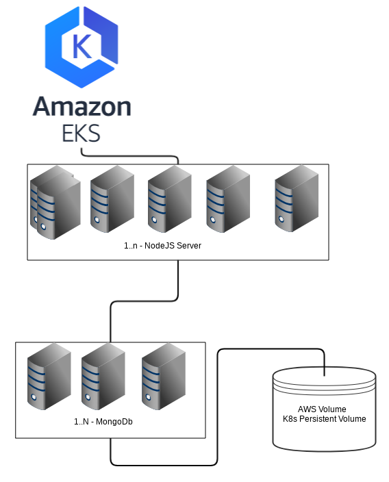

# Task Todo to Kubernetes

- The idea of this immutable infrastructure is: 
Create the new k8s cluster using the AWS EKS and execute the deploy of a Mongo database server, 
and NodeJS Server to run the node application. Both servers are scalable.


### Install dependencies
- MacOS:
```
brew install awscli
wget https://amazon-eks.s3-us-west-2.amazonaws.com/1.10.3/2018-07-26/bin/darwin/amd64/aws-iam-authenticator 
mv aws-iam-authenticator /usr/local/bin/aws-iam-authenticator
```
- Linux:
```
pip install awscli
wget https://amazon-eks.s3-us-west-2.amazonaws.com/1.10.3/2018-07-26/bin/linux/amd64/aws-iam-authenticator 
mv aws-iam-authenticator /usr/local/bin/aws-iam-authenticator
```

### Set up kubectl to use authentication tokens provided by AWS IAM Authenticator for Kubernetes
This requires a 1.10+ kubectl binary to work. 
If you receive Please enter Username: when trying to use kubectl you need to update to the latest kubectl

## Run the command to create and deploy cluster
- To create the new eks cluster
```./start.sh create```

- To execute the build and deploy the app on cluster
```./start.sh deploy```

- To destroy the eks cluster
```./start.sh destroy```

## Time spent
- terraform scripts: 2 hours
- k8s build and deploy (locally): 1h
- apply k8s deploy on aws eks: 2h  

